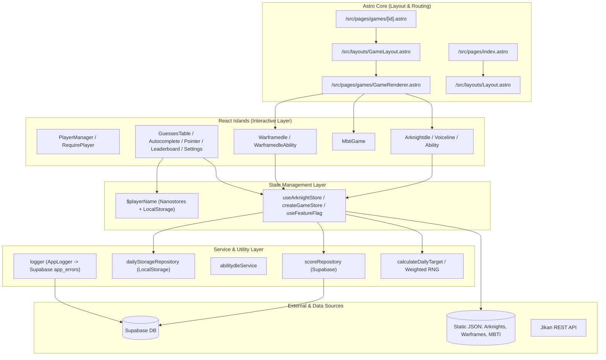

# Memory Bank: Diseño Técnico y Arquitectura (design.md)

## 1. Stack Tecnológico

| Capa / Tecnología | Herramienta | Versión / Detalle | Propósito |
| :--- | :--- | :--- | :--- |
| **Framework Base** | **Astro** | `^5.17.1` | Generación estática (SSG), enrutamiento por archivos, transiciones de vista y arquitectura de islas. |
| **UI Components** | **React** | `^19.2.4` | Componentes interactivos complejos y lógica de estado del juego. |
| **Integración Astro-React** | `@astrojs/react` | `^4.4.2` | Hidratación selectiva de componentes React en el DOM de Astro. |
| **Estilos & Theming** | **Tailwind CSS** | `^4.2.0` (con `@tailwindcss/vite`) | Utilidades CSS, tokens modernos vía `@theme` y temas dinámicos (`data-theme`). |
| **Estado Global Ligero** | **Nanostores** | `^1.1.0` + `@nanostores/react` | Gestión de estado entre islas independientes de Astro y React (`$playerName`). |
| **Estado de Dominio** | **Zustand** | `^5.0.11` | Stores complejos con middlewares (`persist`) para cada juego y feature flags. |
| **Backend & Base de Datos** | **Supabase JS** | `^2.97.0` | Persistencia de puntuaciones (Leaderboard) y reporte de telemetría de errores (`app_errors`). |
| **Animaciones** | **Framer Motion** | `^12.34.3` | Animaciones fluidas en botones e iconos interactivos (ej. botón de reproducción de audio). |
| **Generación Determinista** | **rand-seed** | `^3.0.0` | Generador de números pseudoaleatorios basado en semillas (`PRNG`) para desafíos diarios consistentes. |
| **Parser de Datos** | **PapaParse** | `^5.5.3` | Procesamiento y lectura de archivos CSV estructurados de personajes y datos. |

---

## 2. Arquitectura del Sistema

El proyecto sigue el paradigma de **Astro Islands (Arquitectura de Islas)** combinado con una capa desacoplada de servicios y repositorios en TypeScript.



---

## 3. Patrones de Diseño Implementados

### 3.1. Store Factory Pattern (`createGameStore`)
Ubicación: `src/store/useGameStorage.ts`
- Permite instanciar stores de Zustand tipados genéricamente para cualquier entidad que extienda `BaseGameEntity`.
- Estandariza la inicialización, la selección de modo (`daily` vs `random`), el procesamiento de intentos (`guess`), el cálculo de victoria/derrota y el guardado automático de progreso.

### 3.2. Repository Pattern (Capa de Acceso a Datos)
- **`scoreRepository.ts`**: Abstrae las llamadas a Supabase para leer y registrar récords (`saveDailyScore`, `saveHighScore`, `getDailyTopScores`). Implementa el patrón *Retry con Backoff* (`withRetry`) para tolerancia a fallos.
- **`dailyStorageRepository.ts`**: Abstrae el ciclo de vida del estado diario en `localStorage` (`saveDailyProgress`, `loadDailyProgress`) garantizando invalidación y borrado automático si la fecha del registro no coincide con la fecha del cliente.
- **`gameModeRepository`**: Persistencia del modo de juego actual con caducidad al final del día mediante cookies seguras.

### 3.3. Strategy Pattern & Higher-Order Matchers en Tablas
Ubicación: `src/config/columns.ts` y `src/config/gameTableColumns.tsx`
- Las columnas de las tablas de comparación se definen mediante objetos `ColumnDef<T>`.
- El estilo y feedback de color se delega a funciones generadoras de clases:
  - `createExactMatchClass<T>(key)`: Compara valores primitivos directos.
  - `createArrayMatchClass<T>(key)`: Compara arreglos (ej. tags, playstyles) calculando coincidencia total o parcial mediante intersección de conjuntos (`hasIntersection`, `haveSameElements`).

### 3.4. Seeded PRNG para Desafíos Diarios
Ubicación: `src/utils/game.ts`
- Utiliza la librería `rand-seed` inicializada con una semilla construida como `YYYYMMDD + gameId`.
- Garantiza que la selección del objetivo diario sea completamente determinista y reproducible para todos los clientes en la misma fecha sin requerir un cron job o servidor backend dedicado.

---

## 4. Comunicación entre Capas y Manejo de Estado

```
┌────────────────────────────────────────────────────────┐
│                      Astro Pages                       │
│    (Rutas estáticas generadas con getStaticPaths)      │
└──────────────────────────┬─────────────────────────────┘
                           │ Props / SSR / ClientRouter
┌──────────────────────────▼─────────────────────────────┐
│                     React Islands                      │
│ ┌──────────────────────┐      ┌──────────────────────┐ │
│ │  Nanostores ($player)│◄────►│ Zustand Game Stores  │ │
│ └──────────┬───────────┘      └──────────┬───────────┘ │
└────────────┼─────────────────────────────┼─────────────┘
             │                             │
┌────────────▼─────────────────────────────▼─────────────┐
│                 Services & Repositories                │
│    dailyStorageRepository   │   scoreRepository        │
│    (LocalStorage / Date)    │   (Supabase Client)      │
└─────────────────────────────┴──────────────────────────┘
```

1. **Estado entre Islas independientes**: Se utiliza **Nanostores** (`$playerName`) para comunicar componentes que viven en distintas islas de hidratación (como `Sidebar`, `Pointer`, `NameForm` y los componentes de juego) sin provocar re-renders innecesarios en el árbol de Astro.
2. **Estado local del juego**: Se utiliza **Zustand** para manejar la lógica interna de cada partida (`items`, `target`, `guesses`, `gameStatus`, `gameMode`).
3. **Persistencia**:
   - `playerName` -> `localStorage` (reactivo vía listener en Nanostores).
   - `daily-state-[gameId]` -> `localStorage` con estructura `{ date, guesses, status }`.
   - `[gameId]-GameMode` -> Cookie con expiración a las 23:59:59 del día en curso.
   - `game-feature-flags` -> `localStorage` mediante `persist` middleware de Zustand.

---

## 5. Estructura de Directorios

```
├── public/                     # Assets estáticos servidos directamente
│   ├── data/                   # Datos JSON públicos (MBTI)
│   ├── img/                    # Fondos, imágenes de personajes y mascotas
│   └── favicon.ico / .jpg      # Iconos del sitio
├── src/
│   ├── components/             # Componentes React y Astro
│   │   ├── auth/               # Gestión de jugador (NameForm, PlayerManager, RequirePlayer)
│   │   ├── games/              # Implementaciones de cada juego
│   │   │   ├── arknights/      # Arknightdle (Clásico, VoiceLine, Ability, LevelPath)
│   │   │   ├── guess-anime/    # Juego de anime con Jikan API
│   │   │   ├── guess-mbti/     # Juego de adivinanza de MBTI con tablero interactivo
│   │   │   └── warframedle/    # WarframeDLE y WarframeDLE Habilidades
│   │   ├── ui/                 # Componentes de interfaz reutilizables
│   │   │   ├── Autocomplete/   # Input con búsqueda predictiva y selección visual
│   │   │   ├── GameModeSelector/ # Selector de modo Diario / Infinito
│   │   │   ├── General/        # Botones, Switch de ajustes, Dado de reroll
│   │   │   ├── GuessedTable/   # Tabla genérica de comparaciones (Header, Cell, Table)
│   │   │   ├── Mascot/         # Renderizado de mascota con créditos
│   │   │   ├── Player/         # Reproductor de audio de voces
│   │   │   ├── Settings/       # Menú lateral/dropdown de Feature Flags
│   │   │   ├── Leaderboard.tsx # Drawer con clasificación Top 10
│   │   │   └── Pointer.tsx     # Barra superior de jugador y puntaje actual
│   │   └── GameCard.astro      # Tarjetas de selección de juego en la home
│   ├── config/                 # Definiciones de columnas de tablas y pistas de audio
│   ├── data/                   # Datasets locales en JSON/CSV (Warframes, Operadores, MBTI)
│   ├── hooks/                  # Custom hooks de React (useDailyStorage, useGameScore, etc.)
│   ├── layouts/                # Plantillas principales (Layout.astro, GameLayout.astro, Sidebar)
│   ├── lib/                    # Clientes externos (Supabase, Jikan, Arknights fetchers)
│   ├── pages/                  # Rutas de Astro (index.astro, games/[id].astro)
│   ├── services/               # Lógica de negocio y repositorios (Score, Daily, Logger)
│   ├── store/                  # Stores globales (playerStore, featureFlagsStore, useGameStorage)
│   ├── styles/                 # Estilos globales y tokens Tailwind (@theme)
│   ├── types/                  # Tipados TypeScript organizados por dominio
├── docs/                       # Memory Bank: Documentación viva del proyecto
│   ├── specs.md                # Especificaciones funcionales y catálogo de juegos
│   ├── design.md               # Arquitectura técnica, diseño y patrones
│   ├── progress.md             # Estado actual del desarrollo y catálogo de bugs
│   └── task.md                 # Hoja de ruta y tareas pendientes por fases
├── GEMINI.md                   # Directivas y reglas del sistema para agentes/devs
├── astro.config.mjs            # Configuración de Astro, Tailwind v4 y React
├── package.json                # Dependencias y scripts del proyecto
└── tsconfig.json               # Configuración de TypeScript y path aliases (@components, etc.)
```

---

## 6. Sistema de Estilos y Theming

- **Tailwind CSS v4 `@theme`**: Los colores principales, neutros, estados de victoria (`--color-success`), error (`--color-error`) y advertencia (`--color-warning`) se definen centralizadamente en `src/styles/global.css`.
- **Temas Específicos por Juego**: Mediante el atributo `data-theme` en el `<body>` de `GameLayout.astro`:
  - `data-theme="warframedle"`: Paleta temática con colores neón cyan (`oklch(0.75 0.22 195)`), magenta neón y tipografía *Orbitron*.
  - `data-theme="arknightdle"`: Paleta táctica oscura con contrastes cyan/teal y tipografía *Oswald*.
- **Transiciones de Página**: Uso de `<ClientRouter />` de Astro para transiciones suaves (`fade`) entre rutas sin recargar completamente el navegador.
- **Scrollbars & Cursores**: Personalización de scrollbars delgados y cursor temático retro (*Chisato pointer*).

---

## 7. Modelo de Datos y Backend (Supabase)

### Tabla `leaderboard`
| Campo | Tipo | Descripción |
| :--- | :--- | :--- |
| `id` | `uuid / int` | Clave primaria autogenerada |
| `game_id` | `text` | Identificador del juego (ej: `arknightdle`, `warframedle`, `guess-mbti`) |
| `player_name`| `text` | Nombre / Alias del jugador |
| `score` | `numeric / int` | Número de intentos (para juegos diarios) o puntuación acumulada |
| `created_at` | `timestamptz` | Timestamp de inserción para filtrado por fecha |

### Tabla `app_errors`
| Campo | Tipo | Descripción |
| :--- | :--- | :--- |
| `id` | `uuid / int` | Clave primaria |
| `message` | `text` | Mensaje y stacktrace del error |
| `context` | `jsonb` | Metadatos y contexto adicional del error |
| `url` | `text` | URL / Vista donde ocurrió el incidente |
| `created_at` | `timestamptz` | Timestamp del evento |
